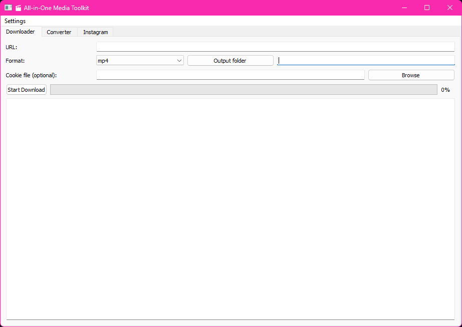
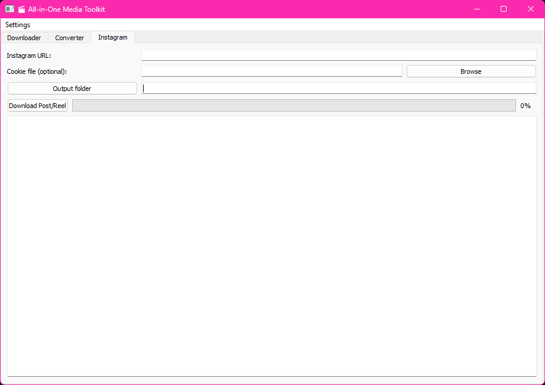

# 🎬 All-in-One Media Toolkit

An elegant desktop app for **downloading and converting media** — no more juggling online converters.  
Built with **Python** + **PyQt5** and designed for speed, simplicity, and power.  

---

## ✨ Features
- ⬇️ **YouTube Downloader** — grab videos or MP3s in one click.  
- 📸 **Instagram Tools** — download reels, posts, and images in high quality.  
- 🔄 **Smart Converter** — auto-detects file type and suggests conversions:  
  - Video ↔ Audio  
  - Images (PNG, JPG, ICO, WEBP)  
  - Documents (PDF, DOCX, TXT, MD)  
- 📂 **Custom Output Folders** — stay organized with flexible saving.  

---

## 🚀 Quick Start

```bash
git clone https://github.com/CaptMarvelous/media-toolkit.git
cd media-toolkit
pip install -r requirements.txt
python media_toolkit.py
```
👉 Requires Python 3.9+ and ffmpeg installed in your PATH.

---

## 🖼️ Preview




---

## 📄 License
Released under the MIT License.
Use it, modify it, share it — just give credit.

---

## 💡 Built to save time.
No ads. No limits. Just media freedom.

---
